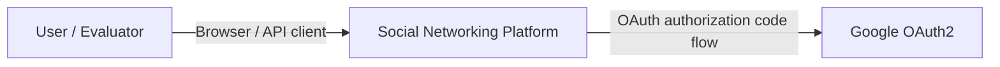

# C4 Context View

## Notes

- The API Gateway is the public entry point for the platform.
- Google OAuth2 is the only external identity provider.
- Local automated tests can use seeded JWT and Redis sessions to avoid external Google dependency.
