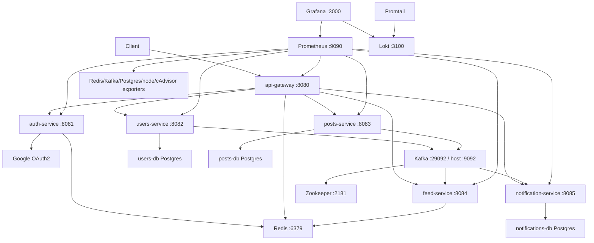

# Container And Deployment View

## Local Deployment

- Docker Compose runs one instance of each service plus infrastructure.
- Services use Docker network names from `deploy/compose/compose.yml`.
- Prometheus and Grafana are provisioned for local observability and demo validation.
